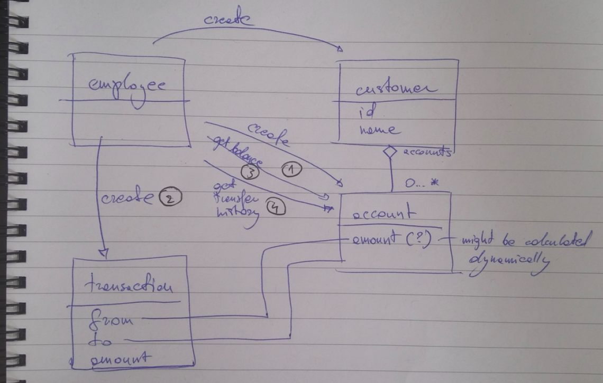

# Example API with proper specs and documentation


## `Step #1` - initial parsing of [the requirements](docs/build_a_bank.md)

PR: [https://github.com/seeker89/example_api/pull/1](https://github.com/seeker89/example_api/pull/1)

Ok, so this is kind of what we're looking at




The entities we'll need to implement that:

- [ ] employee (the one with the power to do things)
- [x] customer
- [x] account
- [x] transaction

The actions that are explicit in the requirements (the numbers from above):

1. Create a new bank account for a customer, with an initial deposit amount. A single customer may have multiple bank accounts.
2. Transfer amounts between any two accounts, including those owned by different customers.
3. Retrieve balances for a given account.
4. Retrieve transfer history for a given account.

Implicit things:

- authentication (and session management) for the employees
- creation of users


Other implicit actions which will __not__ become part of the public API, but will need to be thought of anyway:

- CRUD of employees
- deletion and updates of customers


## `Step #2` - write up an API description in swagger

PR: [https://github.com/seeker89/example_api/pull/2](https://github.com/seeker89/example_api/pull/2)

I'll leave out the employees authentication for now to kick start.


## `Step #3` - bootstrap node-based api, serve docs and such

PR: [https://github.com/seeker89/example_api/pull/3](https://github.com/seeker89/example_api/pull/3)

So now you can run `make run` to read the documentation and have a play with the API. Time for a burrito.


## `Step #4` - TDD Customer model + in-memory backend

PR: [https://github.com/seeker89/example_api/pull/4](https://github.com/seeker89/example_api/pull/4)


## `Step #5` - TDD Account model + in-memory backend

PR: [https://github.com/seeker89/example_api/pull/5](https://github.com/seeker89/example_api/pull/5)


## `Step #6` - TDD Transaction model + in-memory backend

PR: [https://github.com/seeker89/example_api/pull/6](https://github.com/seeker89/example_api/pull/6)


Cool, so now that we have all the bricks tested, let's write some integration tests and wire all of it together.


## `Step #7` - TDD wire up all controllers using `supertest` to make real calls to a real instance of the app

PR: [https://github.com/seeker89/example_api/pull/7](https://github.com/seeker89/example_api/pull/7)


## `Step #8` - aiming for full code coverage.

The test coverage report can be found [here](https://github.com/seeker89/example_api/blob/master/coverage/lcov-report/index.html)

You can also generate it with `make coverage` if you have `istanbul` installed (`npm install -g instanbul`).


It looks like this 

# Finished product

```sh
 make test
LOG=error mocha


  Account in-memory
    #findByNumber
      ✓ should find one of the predefined accounts by number
      ✓ should return undefined for non-existing account
    #findByOwnerId
      ✓ should find all accounts of the user
      ✓ should return an empty array for when no accounts found
    #create
      ✓ should create and return a new account with a number
      ✓ should create and then find a new account
      ✓ should not create without name
      ✓ should not create without name

  Account
    #constructor
      ✓ should not accept no storage
    #get & set
      ✓ should get and set things
    #save
      ✓ should save things
    #dot notation
      ✓ should work like a charm
      ✓ should work like a charm for setters too
    #toObject
      ✓ should work like a charm

  Customer in-memory
    #find
      ✓ should find one of the predefined customers
      ✓ should return undefined for non-existing customer
    #create
      ✓ should create and return a new user with random id
      ✓ should create and then find a new user
      ✓ should not create without name

  Customer
    #constructor
      ✓ should not accept no storage
    #get & set
      ✓ should get and set things
    #save
      ✓ should save things
    #dot notation
      ✓ should work like a charm
      ✓ should work like a charm with setters too
    #toObject
      ✓ should work like a charm

  Integration
    #account
      PUT /account
        ✓ should create an account for a valid user (103ms)
        ✓ should create an account with a right balance
        ✓ should not create an account for a non-existent user
        ✓ should not create an account without name
      GET /account
        ✓ should get an account for a valid account
        ✓ should return 404 for non existin account
      GET /account/history
        ✓ should get transactions for a valid account
        ✓ should return 404 for non existing account
      PUT /transfer
        ✓ should return 404 for non existing origin account
        ✓ should return 404 for non existing origin account
        ✓ should do a transaction properly

  Integration
    #customer
      PUT /customer
        ✓ should create an customer for a valid user
        ✓ should not create a customer without name
      GET /customer
        ✓ should get an customer for a valid customer id
        ✓ should return 404 for non existing id
        ✓ should get a customer with two accounts

  Integration
    #debug
      /
        ✓ should give running stats

  Transaction in-memory
    #find
      ✓ should find all transactions from account
      ✓ should find all transactions to account
      ✓ should find all transactions about account 000001
      ✓ should find all transactions about account 000002
      ✓ should return empty array when no transactions
    #create
      ✓ should create and return a new transaction
      ✓ should create and then find a new user
      ✓ should not create without origin
      ✓ should not create without destination
      ✓ should not create without amount

  Transaction
    #constructor
      ✓ should not accept no storage
    #get & set
      ✓ should get and set things
    #save
      ✓ should save things
    #dot notation
      ✓ should work like a charm
      ✓ should work like a charm with setters too
    #toObject
      ✓ should work like a charm


  58 passing (697ms)
```

## Final thoughts

I was aiming for quality, testability and reusability.

I implemented an in-memory store, with just the right level of abstraction to be able to switch to pretty much any other database by just re-implementing the manager classes.

The authentication for the employees is prepared, but the employees entity isn't implemented - it ignores the api_key sent and lets anyone do aything.

I heavily commented the API protocol description, and I also described the models rather in detail. With the controllers, I tried to write code which doesn't require comments.


I added that as an after-thought through PR: [https://github.com/seeker89/example_api/pull/8](https://github.com/seeker89/example_api/pull/8)
